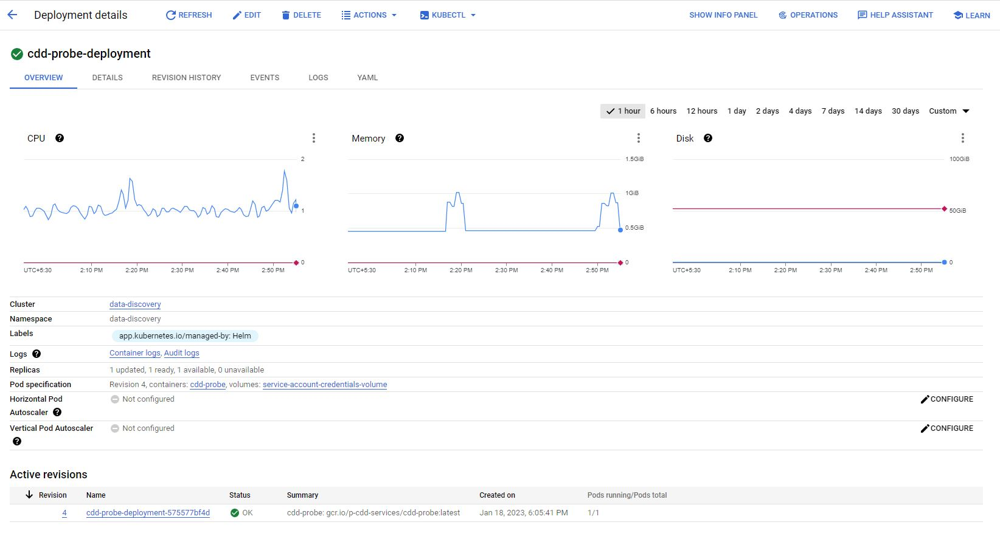
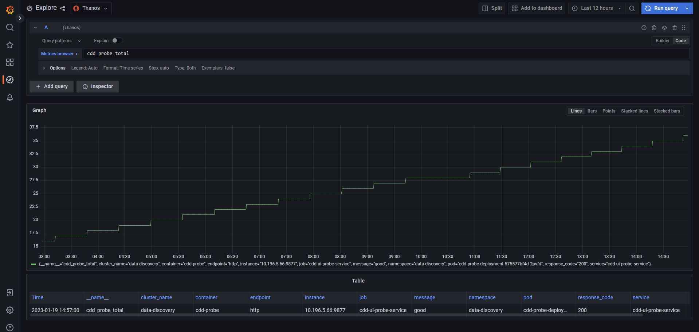

# README FILE

## Test User details

1. In the system Environment Variables, create variables as below
   TESTUSER1='DELFI-6976-SM-009@slb.com'
   TESTUSERPASSWORD1='TWFjaGluZV4xMjM0NTY='
   SECRET_KEY1='fssknsltfkc2sxhy'

## Probe

Probe tests can be found here : `./test/specs/ProbeTests` folder where in we have three tests doing the below operations :

1. Make sure user is able to login and GIS Map is compeltely loaded. We also measure performance of the GIS Map in this test
2. Create a cocllection and delete it
3. Enable Focus Mode, create and delete a collection with more complex steps involved

## Probe integration with Prometheus

The Probes need to update the Prometheus metrics when it runs. The Prometheus Metrics are created here : `./probe-deployment/files/metrics.py`. We have selected "python" as the default language for creating probes and creating prometheus http server as the "prom-client" python package supports almost all the use cases as compared to the "prom-client" npm package.

Metrics example :

```py
def prometheus_metrics(responseCode, responseMessage):
    g = Gauge('cdd_probe_total',
              'probe correctness measurements', ['response_code', 'message'],  multiprocess_mode='livesum', registry=CollectorRegistry())
    g.labels(responseCode, responseMessage).inc()
```

I have implemented the calling of the metrics function using "globals" utility of python as below :

```py
if __name__ == '__main__':
    if len(sys.argv) == 5:
        globals()[sys.argv[1]](sys.argv[2], sys.argv[3], sys.argv[4])
    if len(sys.argv) == 4:
        globals()[sys.argv[1]](sys.argv[2], sys.argv[3])
```

The Prometheus HTTP Server is present here : `./probe-deployment/files/exporter.py`

The tests are then integrated with Probe metrics as below, since your Probe spec files are `.js` and our metrics are in Python, there needs to be an interconnectivity for JS to call the python functions and also have access to the function's response. This is achieved using

```py
    # Prepare object to be passed into Python Shell
    var options = {
      mode: 'text',
      pythonOptions: ['-u'],
      args: ['prometheus_metrics', 200, "good"] # Calling prometheus_metrics function and passing "200" as the response code with "good" as the response message
    };

    # Pass into Python shell
    PythonShell.run(`${process.cwd()}/probe-deployment/files/metrics.py`, options, function (err) {
      if (err) throw err;
      console.log('finished'); # Log Finished when everything is good from metrics.py file else log err
    });
```

## Building of Docker Image for Probe and deployment

The Probe Docker image `./probe.Dockerfile` is built here : <https://dev.azure.com/slb-swt/gaia/_build?definitionId=21320> and the `deploy` stage installs the helm chart `./probe-deployment/Chart.yaml` to the PROD EU GKE cluster resulting in Probe deployment, its exposition through a Kubernetes Service and a Service Monitor which ensures that the metrics are scraped by Prometheus from the target service's /metrics endpoint and exposed here on port 9877



Deployment can be found here : <https://console.cloud.google.com/kubernetes/deployment/europe-west4/data-discovery/data-discovery/cdd-probe-deployment/overview?project=p-cdd-services&pageState=(%22savedViews%22:(%22i%22:%22083c15637c88405981aec69b131a4276%22,%22c%22:%5B%22gke%2Feurope-west4%2Fdata-discovery%22,%22gke%2Fus-central1%2Fdata-discovery-us%22%5D,%22n%22:%5B%22data-discovery%22%5D))>

## Logs for Probe

Logs can be found at Grafana - Loki : <https://grafana-prod.discovery.cloud.slb-ds.com/explore?orgId=1&left=%7B%22datasource%22:%22F1hCh5enk%22,%22queries%22:%5B%7B%22refId%22:%22A%22,%22expr%22:%22%7Bapp%3D%5C%22cdd-probe%5C%22%7D%22,%22queryType%22:%22range%22,%22datasource%22:%7B%22type%22:%22loki%22,%22uid%22:%22F1hCh5enk%22%7D,%22editorMode%22:%22code%22%7D%5D,%22range%22:%7B%22from%22:%22now-1h%22,%22to%22:%22now%22%7D%7D>


## Metrics for Probe

Metrics can be found is Grafana - Thanos : <https://grafana-prod.discovery.cloud.slb-ds.com/explore?orgId=1&left=%7B%22datasource%22:%22E12jhcenz%22,%22queries%22:%5B%7B%22refId%22:%22A%22,%22datasource%22:%7B%22type%22:%22prometheus%22,%22uid%22:%22E12jhcenz%22%7D,%22editorMode%22:%22code%22,%22expr%22:%22cdd_probe_total%22,%22legendFormat%22:%22__auto%22,%22range%22:true,%22instant%22:true%7D%5D,%22range%22:%7B%22from%22:%22now-12h%22,%22to%22:%22now%22%7D%7D>



## Probe Run Info

If the Image Deploy pipeline shows "I am not allowed to deploy because there are no available pods, may be someone reduced the replica set to 0" message in "Deploy Probe to PROD-EU cluster" task in the pipeline, this means that the probe replica has been set to 0. After this run the Replica scale pipeline to scale the probe pod to 1 from 0"

Pipeline for the Replica Scale can be found here : <https://dev.azure.com/slb-swt/gaia/_build?definitionId=21869>
Pipeline for the image deploy can be found here : <https://dev.azure.com/slb-swt/gaia/_build?definitionId=21320>

0 here means -> we scale to pods to 0 meaning that probe won't run &
1 here mean -> we scale the pods to 1 meaning that probe would run .

To run probe increase the Scale at 1 which was set to 0.
To stop the probe running reduce the scale which was set to 1.
